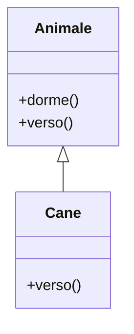

<!--
README: Introduzione a Java — completo ed elegante
Lingua: Italiano
-->

# 📘 Introduzione a Java — Guida completa (da principiante ad intermedio-avanzato)

[](#licenza) [](#requisiti) [](#build-e-esecuzione) [](#integrazione-continuo)

> Una guida chiara, completa e pronta all'uso per imparare Java: dalle basi della sintassi fino a concetti più avanzati come **classi astratte**, **interfacce**, **generics**, test automatici e best practices. Ideale per studenti, sviluppatori alle prime armi e chi vuole un README da inserire nel proprio repository GitHub.

---

## 🧭 Sommario

- [Introduzione rapida](#introduzione-rapida)
- [Requisiti](#requisiti)
- [Struttura di un progetto Java](#struttura-di-un-progetto-java)
- [Esempio: Hello World](#esempio-hello-world)
- [Tipi di dato e variabili](#tipi-di-dato-e-variabili)
- [Controllo di flusso](#controllo-di-flusso)
- [Array, String e API utili](#array-string-e-api-utili)
- [OOP: classi, oggetti, ereditarietà](#oop-classi-oggetti-ereditarieta)
- [Classi astratte e interfacce](#classi-astratte-e-interfacce)
- [Generics](#generics)
- [Eccezioni e gestione degli errori](#eccezioni-e-gestione-degli-errori)
- [Package, moduli e convenzioni](#package-moduli-e-convenzioni)
- [Tooling: Maven, Gradle, JDK, IDE](#tooling-maven-gradle-jdk-ide)
- [Testing: JUnit (esempi)](#testing-junit-esempi)
- [Best Practices e stile di codice](#best-practices-e-stile-di-codice)
- [Esempi pratici (snippet)](#esempi-pratici-snippet)
- [Diagrammi UML & Mermaid](#diagrammi-uml--mermaid)
- [Contributing, Licenza e Risorse](#contributing-licenza-e-risorse)
- [FAQ rapida](#faq-rapida)

---

## ✨ Introduzione rapida

Java è un linguaggio di programmazione ad oggetti, tipizzato staticamente, pensato per portabilità ("Write Once, Run Anywhere"). È molto usato in applicazioni enterprise, Android (versioni precedenti), sistemi embedded e backend.

---

## 🛠️ Requisiti

- JDK 11 o successivo (consigliato JDK 17 LTS o JDK 21+ per nuove features)
- Maven o Gradle (opzionale, ma raccomandato)
- Un IDE: IntelliJ IDEA, Eclipse, VS Code + Extension Java

---

## 🧱 Struttura di un progetto Java (esempio Maven)

```
my-java-project/
├── pom.xml
├── src/
│   ├── main/
│   │   ├── java/
│   │   │   └── com/example/app/
│   │   │       ├── Main.java
│   │   │       └── model/
│   │   │           └── Persona.java
│   │   └── resources/
│   └── test/
│       └── java/
│           └── com/example/app/
│               └── MainTest.java
└── README.md
```

---

## 💡 Esempio: Hello World

```java
// src/main/java/com/example/app/Main.java
package com.example.app;

public class Main {
    public static void main(String[] args) {
        System.out.println("Hello, Java World!");
    }
}
```

Compilare ed eseguire (CLI):
```bash
# con javac
javac -d out src/main/java/com/example/app/Main.java
java -cp out com.example.app.Main

# con Maven
mvn compile
mvn exec:java -Dexec.mainClass="com.example.app.Main"
```

---

## 🔡 Tipi di dato e variabili

### Tipi primitivi
`byte, short, int, long, float, double, char, boolean`

Esempio:
```java
int count = 42;
double price = 19.99;
char letter = 'A';
boolean flag = true;
```

### Tipi di riferimento
`String`, array, classi, interfacce, collezioni (`List`, `Set`, `Map`).

---

## 🔁 Controllo di flusso

`if/else`, `switch`, `for`, `while`, `do-while`, `for-each`.

```java
for (int i = 0; i < 5; i++) {
    System.out.println(i);
}

switch (x) {
    case 0 -> System.out.println("zero");
    default -> System.out.println("altro");
}
```

---

## 🧩 Array, String e API utili

```java
String s = "Ciao";
int len = s.length();
String upper = s.toUpperCase();

int[] arr = {1,2,3};
for (int v : arr) { ... }
```

API utili: `java.util.Arrays`, `java.util.Collections`, `java.util.stream`.

---

## 🧭 OOP: classi, oggetti, ereditarietà

```java
public class Persona {
    private String nome;
    private int eta;

    public Persona(String nome, int eta) {
        this.nome = nome;
        this.eta = eta;
    }

    public void saluta() {
        System.out.println("Ciao, sono " + nome);
    }

    // getters & setters
}
```

Ereditarietà:
```java
public class Animale {
    public void dorme() { System.out.println("Zzz"); }
}

public class Cane extends Animale {
    public void verso() { System.out.println("Bau!"); }
}
```

---

## 🧱 Classi astratte e interfacce

### Classi astratte
- Non possono essere istanziate.
- Possono avere metodi astratti (senza corpo) e concreti.

```java
public abstract class Veicolo {
    private String targa;
    public Veicolo(String targa) { this.targa = targa; }

    public abstract void avvia();

    public void info() {
        System.out.println("Targa: " + targa);
    }
}
```

```java
public class Auto extends Veicolo {
    public Auto(String targa) { super(targa); }
    @Override
    public void avvia() { System.out.println("Auto avviata"); }
}
```

### Interfacce
- Definiscono contratti; possono avere metodi predefiniti (`default`) e metodi statici.

```java
public interface Volante {
    void vola();
    default void atterra() { System.out.println("Sto atterrando"); }
}
```

Implementazione multipla:
```java
public class Aereo implements Volante {
    public void vola() { System.out.println("Sto volando"); }
}
```

---

## 🧠 Generics (tipi parametrizzati)

Permettono di creare classi/metodi riusabili con tipi parametrizzati.

```java
public class Box<T> {
    private T value;
    public void set(T value) { this.value = value; }
    public T get() { return value; }
}
```

Uso:
```java
Box<String> b = new Box<>();
b.set("ciao");
String s = b.get();
```

Wildcard:
- `List<? extends Number>` — lettura covariante.
- `List<? super Integer>` — scrittura controvariante.

---

## ⚠️ Eccezioni e gestione degli errori

Checked vs Unchecked exceptions.

```java
public class MyException extends Exception {
    public MyException(String message) { super(message); }
}

public void leggiFile(String path) throws MyException {
    try {
        // IO operation
    } catch (IOException e) {
        throw new MyException("Errore lettura: " + e.getMessage());
    }
}
```

Esempio `try-with-resources`:
```java
try (BufferedReader br = new BufferedReader(new FileReader("file.txt"))) {
    String line;
    while ((line = br.readLine()) != null) {
        System.out.println(line);
    }
} catch (IOException e) {
    e.printStackTrace();
}
```

---

## 📦 Package, moduli e convenzioni

Dichiarare un package:
```java
package com.example.app;
```

Java Module System (JPMS, `module-info.java`) — organizzazione a livello di modulo (Java 9+).

Convenzioni:
- `com.company.project` per i package
- Nomi delle classi: PascalCase
- Metodi e variabili: camelCase

---

## ⚙️ Tooling: Maven e Gradle (snippet)

### Maven (`pom.xml`) - snippet minimo
```xml
<project ...>
  <modelVersion>4.0.0</modelVersion>
  <groupId>com.example</groupId>
  <artifactId>my-app</artifactId>
  <version>1.0.0</version>
  <properties>
    <maven.compiler.source>17</maven.compiler.source>
    <maven.compiler.target>17</maven.compiler.target>
  </properties>
  <dependencies>
    <dependency>
      <groupId>org.junit.jupiter</groupId>
      <artifactId>junit-jupiter</artifactId>
      <version>5.9.3</version>
      <scope>test</scope>
    </dependency>
  </dependencies>
</project>
```

### Gradle (Kotlin DSL) - snippet minimo
```kotlin
plugins {
    java
}

java {
    sourceCompatibility = JavaVersion.VERSION_17
    targetCompatibility = JavaVersion.VERSION_17
}

repositories { mavenCentral() }

dependencies {
    testImplementation("org.junit.jupiter:junit-jupiter:5.9.3")
}
```

---

## ✅ Testing: JUnit 5 (esempio di test)

```java
import org.junit.jupiter.api.Test;
import static org.junit.jupiter.api.Assertions.*;

class MathUtilsTest {
    @Test
    void sumWorks() {
        assertEquals(4, 2 + 2);
    }
}
```

Eseguire i test:
```bash
mvn test
# oppure con Gradle
gradle test
```

---

## 🧾 Documentazione: Javadoc

Generare la documentazione:
```bash
javadoc -d docs src/main/java/com/example/app/*.java
```

Esempio di commento Javadoc:
```java
/**
 * Rappresenta una persona.
 * @param nome il nome della persona
 */
public class Persona { ... }
```

---

## 📐 Diagrammi UML & Mermaid

Esempio Mermaid per una relazione Semplice:


(In GitHub README i diagrammi Mermaid sono supportati se abilitati nella repository)

---

## 🧩 Esempi pratici (snippet utili)

### Builder pattern (esempio rapido)
```java
public class User {
    private final String name;
    private final int age;

    private User(Builder b) {
        this.name = b.name;
        this.age = b.age;
    }

    public static class Builder {
        private String name;
        private int age;
        public Builder setName(String name) { this.name = name; return this; }
        public Builder setAge(int age) { this.age = age; return this; }
        public User build() { return new User(this); }
    }
}
```

### Stream API (operazioni comuni)
```java
List<String> names = List.of("Anna","Luca","Mario");
List<String> upper = names.stream()
    .filter(s -> s.length() > 3)
    .map(String::toUpperCase)
    .collect(Collectors.toList());
```

---

## 🎯 Best Practices e stile di codice

- Preferire l'immutabilità quando possibile.
- Limitare l'uso di variabili globali.
- Scrivere test automatici e mantenerli veloci.
- Evitare `null` non necessari — usare `Optional<T>` quando opportuno.
- Seguire convenzioni di naming e commentare API pubbliche con Javadoc.

---

## 🔁 Integrazione Continua (esempio GitHub Actions)

`.github/workflows/ci.yml`
```yaml
name: Java CI

on: [push, pull_request]

jobs:
  build:
    runs-on: ubuntu-latest
    steps:
      - uses: actions/checkout@v4
      - name: Set up JDK 17
        uses: actions/setup-java@v4
        with:
          distribution: 'temurin'
          java-version: '17'
      - name: Build with Maven
        run: mvn -B package --file pom.xml
      - name: Test
        run: mvn test
```

---

## 🧭 Strumenti utili e risorse

- Documentazione ufficiale Java: https://docs.oracle.com/en/java/
- OpenJDK: https://openjdk.org/
- Maven: https://maven.apache.org/
- Gradle: https://gradle.org/
- JUnit: https://junit.org/

---

## 🤝 Contributing

Grazie per voler contribuire! Segui questi passi:
1. Forka il repository
2. Crea un branch feature `git checkout -b feature/nome`
3. Fai commit chiari `git commit -m "feat: aggiunge esempio X"`
4. Apri una Pull Request descrivendo i cambiamenti

Aggiungi o aggiorna i test quando appropriato.

---

## 📜 Licenza

Questo progetto è rilasciato sotto licenza **MIT**. Vedi `LICENSE` per i dettagli.

---

## ❓ FAQ rapida

**D: Quale JDK dovrei usare?**  
R: Per progetti nuovi usa JDK 17 o superiore. JDK 11 è ancora molto usato (LTS).

**D: È obbligatorio usare Maven o Gradle?**  
R: No, ma sono fortemente consigliati per la gestione delle dipendenze e le build automatizzate.

---

## 🧾 Note finali

Questo README è pensato per essere un **punto di partenza completo**: contiene esempi chiari, snippet pronti all'uso e indicazioni su strumenti e pratiche. Puoi personalizzarlo ulteriormente (aggiungere diagrammi UML, esempi avanzati, demo) in base al tuo progetto.

---

*Generato e migliorato per te — se vuoi, posso:*
- tradurlo in inglese,
- generare anche `README.pdf`,
- aggiungere diagrammi UML completi,
- creare un template di progetto completo con Maven/Gradle.
