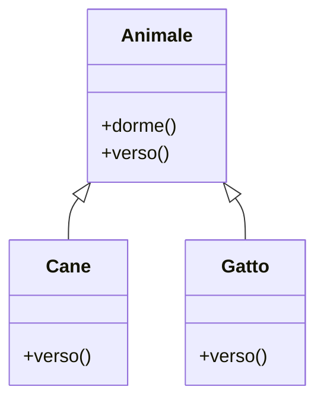
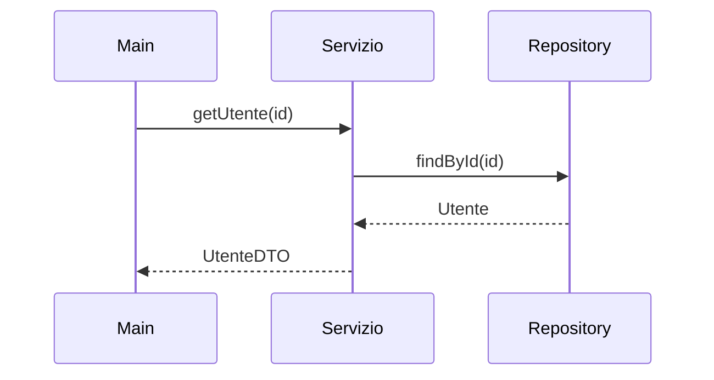
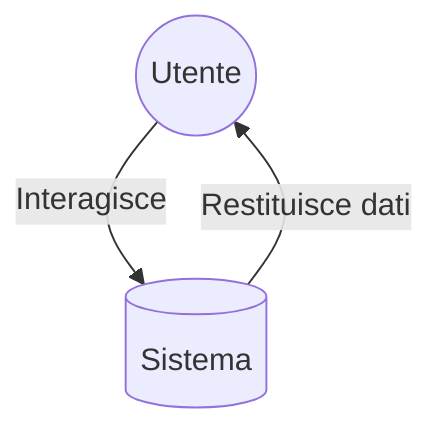

# 📘 Introduzione a Java — Guida completa (con diagrammi UML)

...

## 📐 Diagrammi UML (Mermaid)

### 1. Class Diagram – Gerarchia Animale


### 2. Sequence Diagram – Flusso di un metodo


### 3. Use Case Diagram – Semplice applicazione


(Nota: GitHub supporta Mermaid nativamente.)

...

## 🚀 Come caricare tutto su GitHub

### 🔧 1. Crea un nuovo repository su GitHub
1. Vai su https://github.com  
2. Clicca **New Repository**  
3. Dai un nome al progetto  
4. Scegli “Public” o “Private”  
5. **NON** creare un README (lo carichiamo noi!)

---

### 📂 2. Prepara la cartella sul tuo computer
Metti dentro:
- `README.md` (questo file)
- eventuali file `src/`
- `pom.xml` o `build.gradle` (se usi Maven/Gradle)

---

### 🧪 3. Inizializza il progetto
Apri la cartella e usa il terminale:

```bash
git init
git add .
git commit -m "Primo commit: aggiunto README"
```

---

### 🔗 4. Collega la cartella al repository GitHub

GitHub ti mostrerà il comando esatto, ma in generale è questo:

```bash
git remote add origin https://github.com/TUO_USERNAME/NOME_REPO.git
git branch -M main
git push -u origin main
```

---

### 🔄 5. Aggiornare il repository in futuro
```bash
git add .
git commit -m "aggiornamento"
git push
```

---

## 🎉 Fatto!
Il tuo README completo, ricco di diagrammi UML, sarà ora visibile nel repository GitHub.

Se vuoi posso:
- completare l’intero progetto Java con package, codice e test
- aggiungere altri diagrammi UML più complessi
- creare anche README.pdf, README.html o README.docx
